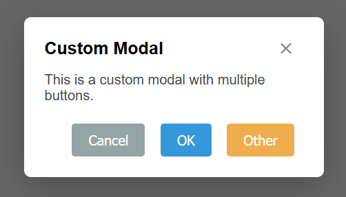

# @lukasgoulois/modal

A lightweight and modular modal component written in vanilla JavaScript.
Easily customizable, plug-and-play, and zero dependencies.



---

## ✨ Features

* ✅ Vanilla JS, no dependencies
* ✅ Alert / Confirm modals
* ✅ Fully customizable (title, buttons, content)
* ✅ ESC to close
* ✅ Optional close button
* ✅ Default size: `small` (configurable)
* ✅ Clean CSS included
* ✅ Modular and easily overridable styles with CSS variables
* ✅ Support for small, medium, and large modal sizes
* ✅ Callback support for `onClose`

---

## 🚀 Installation

### Using npm

```bash
npm install @lukasgoulois/modal
```

### Using CDN (coming soon)

---

## 🔧 Usage

### Import

```js
import Modal from '@lukasgoulois/modal';
import '@lukasgoulois/modal/modal.css';
```

### Alert

```js
Modal.alert('Hello world!', 'My Modal', {
  onClose: () => console.log('Alert closed!')
});
```

### Confirm

```js
Modal.confirm('Are you sure?', 'Please Confirm', {
  escToClose: true,
  closeOnOutsideClick: false,
  onClose: () => console.log('Confirm modal closed!')
}).then(confirmed => {
  if (confirmed) console.log('Confirmed!');
});
```

### Custom modal

```js
Modal.custom({
  title: 'Custom Example',
  content: '<p>You can add <strong>HTML</strong> here.</p>',
  options: {
    size: 'large', // small (default), medium, large
    showCloseButton: true, // default is true
    escToClose: true, // default is true
    closeOnOutsideClick: true, // default is true
    onClose: () => console.log('Custom modal closed!')
  },
  buttons: [
    {
      text: 'Cancel',
      classes: ['btn-secondary'],
      onClick: () => console.log('Cancelled')
    },
    {
      text: 'OK',
      classes: ['btn-primary'],
      onClick: () => console.log('Confirmed')
    }
  ]
});
```

### Modal from existing DOM element

```js
Modal.fromId('myModal', {
  showCloseButton: true,
  escToClose: true,
  closeOnOutsideClick: true,
  onClose: () => console.log('Predefined modal closed!')
});
```

---

## 🎨 Customization

### CSS Variables

You can easily override the default styles using CSS variables. Here are the available variables:

```css
:root {
  --modal-bg-color: white;
  --modal-border-radius: 8px;
  --modal-box-shadow: 0 10px 40px rgba(0, 0, 0, 0.25);
  --modal-padding: 1.5rem;

  --modal-small-width: 300px;
  --modal-medium-width: 500px;
  --modal-large-width: 800px;

  --modal-close-btn-top: 10px;
  --modal-close-btn-right: 10px;
  --modal-close-btn-font-size: 1.5rem;
  --modal-close-btn-color: #888;
  --modal-close-btn-hover-color: #333;

  --modal-header-font-size: 1.25rem;
  --modal-body-font-size: 1rem;
  --modal-body-color: #444;

  --modal-footer-margin-top: 1.5rem;
  --modal-btn-padding: 0.6rem 1.2rem;
  --modal-btn-font-size: 1rem;
  --modal-btn-border-radius: 4px;
  --modal-btn-margin-left: 0.5rem;

  --btn-primary-bg: #3498db;
  --btn-primary-color: white;
  --btn-primary-hover-bg: #2980b9;

  --btn-secondary-bg: #95a5a6;
  --btn-secondary-color: white;
  --btn-secondary-hover-bg: #7f8c8d;

  --btn-danger-bg: #e74c3c;
  --btn-danger-color: white;
  --btn-danger-hover-bg: #c0392b;
}
```

### Example

To change the background color of the modal:

```css
:root {
  --modal-bg-color: #f9f9f9;
}
```

---

## 🧪 Development & Testing

Clone the repo and open `test.html` in your browser.

```bash
git clone https://github.com/Nakougiko/modal.git
cd modal
npm install
```

Or link locally:

```bash
npm link
# in your other project
npm link @lukasgoulois/modal
```

---

## 📂 Project structure

```
modal-package/
├── modal.js         # Main module
├── modal.css        # Styles for the modal
├── test.html        # Demo page
├── LICENSE
└── package.json
```

---

## 📄 License

MIT © [Lukas Goulois](https://github.com/Nakougiko)
